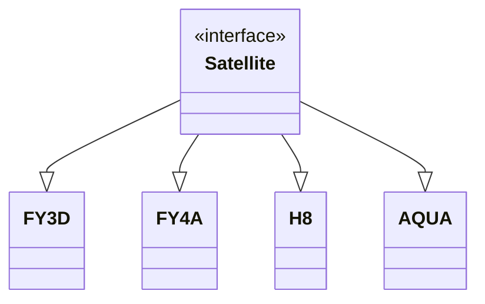
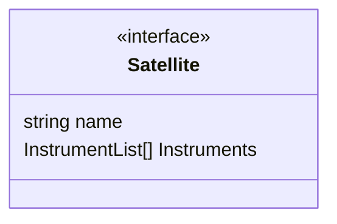
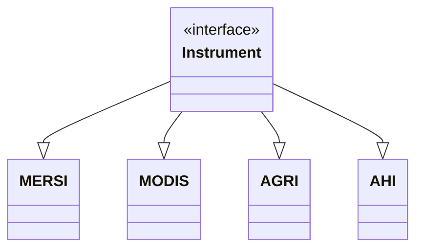
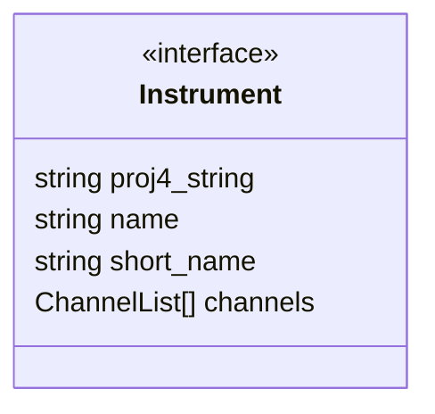
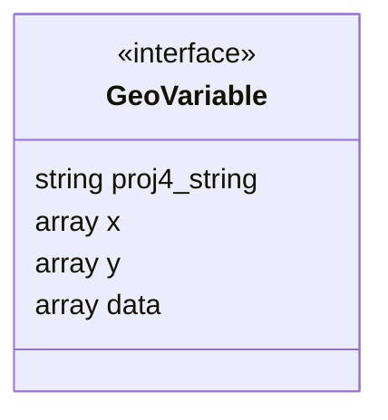

# 设计
气象卫星的抽象库`satpy`

## 层级

## 框架图

### Satellites模块

#### 结构

```mermaid
classDiagram

class Satellite{
  <<interface>>
}
Satellite --|> FY3D
Satellite --|> FY4A
Satellite --|> H8
Satellite --|> AQUA
```

#### 详细设计

```mermaid
classDiagram

class Satellite{
  <<interface>>
  string name
  InstrumentList[] Instruments
}
```

### Instruments模块
#### 结构图

```mermaid
classDiagram
class Instrument{
  <<interface>>
}
Instrument --|> MERSI
Instrument --|> MODIS
Instrument --|> AGRI
Instrument --|> AHI

```
#### 详细设计

```mermaid
classDiagram

class Instrument{
  <<interface>>
  string proj4_string
  string name
  string short_name
  ChannelList[] channels
}
```
### GeoVariable模块

```mermaid
classDiagram

class GeoVariable {
  <<interface>>
  string proj4_string
  array x
  array y
  array data
}
```